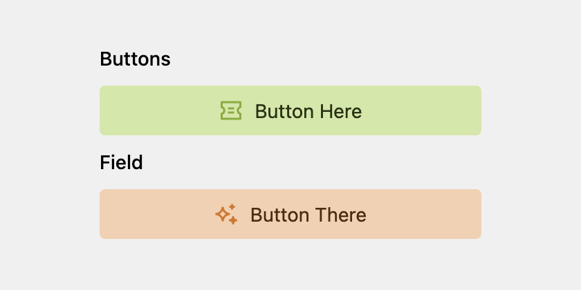

# Kirby Panel Buttons Plugin



A custom Kirby Panel field that features a button. This button can be used to either open a URL in a new tab or to trigger a URL or a webhook, providing feedback on success or error.

## Installation

Requires PHP 8.1 and Kirby 4.0.0 or higher. The recommended way of installing is by using Composer:

```bash
composer require lemmon/kirby-panel-buttons
```

Or download/clone this repo into `site/plugins` of your Kirby project.

## Usage

```yml
webhook_button:
    type: buttons
    label: Button
    text: Button Text # Button text
    url: /button-test # url to call
    theme: positive # (default: null)
    fullwidth: true # (default: null)
    size: lg # (default: "lg")
    icon: lab # (default: null)
    help: Help text # (default: null)
    reload: true # trigger a page refresh on success to display updated data (default: false)

link_button:
    type: buttons
    label: Refresh data
    text: Refresh
    url: https://example.com/ # url to open (default: false)
    open: true
    # disabled: true # (default: false)
```

## Development

1. Install a fresh Kirby StarterKit
2. `cd site/plugins`
3. `git clone` this repo
4. `cd` into this plugin folder

```
npm run dev
```

Roadmap

-   [ ] Add multilang support
-   [ ] Add a buttons section that allows to add some text and multiple buttons

## Credit

This plugin is built upon [Kirby Panel Button Plugin](https://github.com/moritzebeling/kirby-panel-button) by Moritz Ebeling.

## License

MIT
